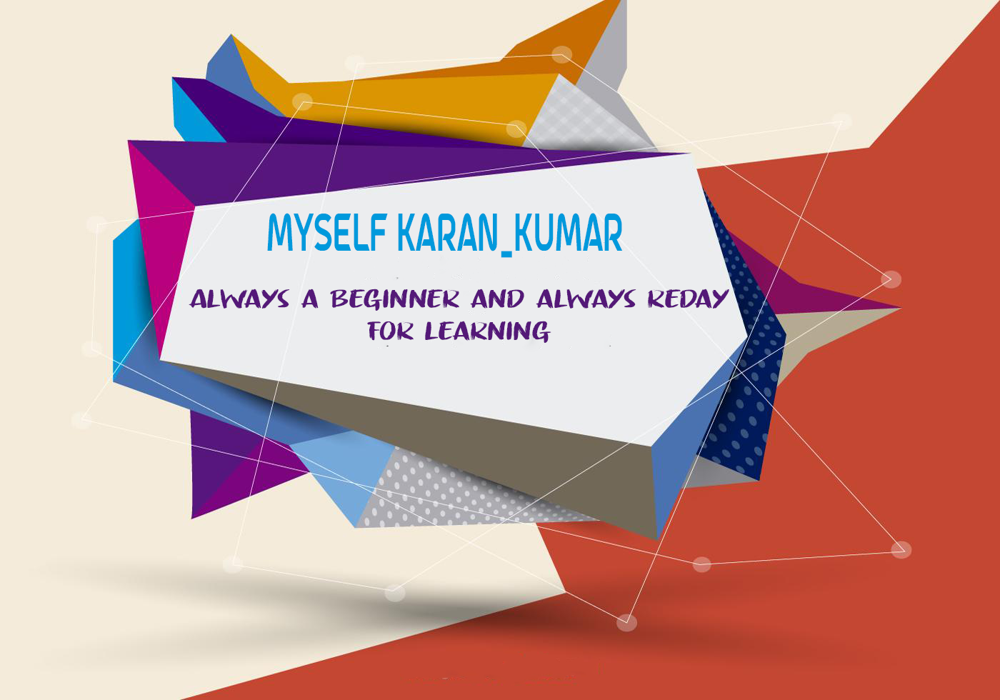

<h3 align="center">

</h3>

<h1 align="center">Hi 👋, I'm Karan Kumar</h1>
<h3 align="center">A student who highly interested Learing new things</h3>

  

  

- 🌱 I’m currently learning **Each and Everything**

- 👨‍💻 All of my projects are available at [https://github.com/KK-Karan-Kumar](https://github.com/KK-Karan-Kumar)

- 💬 Ask me about **MySelf**

- 📫 How to reach me *plexsido.kk@gmail.com**

- ⚡ Fun fact **I can learn anything fast, able to write with my both hand**

-  📄 Know about my experiences [cooming soon](cooming soon)

<h3 align="left">Connect with me:</h3>

&nbsp;

<h3 align="right">

</h3>
